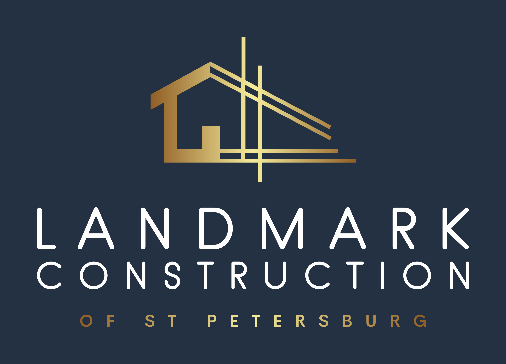

# Landmark Construction  

## 🏗️ About the Site

# Landmark Construction Website (In Development)

This is a professional business website being developed for **Landmark Construction of St. Petersburg, FL**, a residential construction and renovation company.

The site is being built using **Django**, **Django REST Framework**, and **PostgreSQL**, with a focus on clean architecture, maintainability, and real-world usability. It will be deployed as a live client-facing site and also serve as a showcase of my backend development skills and Agile project workflow.

## 💼 Project Goals

- Establish a professional online presence for the business
- Showcase completed construction and renovation projects
- Allow customers to view services and submit contact inquiries
- Provide a maintainable, scalable backend for future growth

## 🔧 Tech Stack (Planned)

- Python 3.x  
- Django 5  
- Django REST Framework  
- PostgreSQL  
- Bootstrap 5 (for simple frontend)  
- Docker & Render for deployment

## 🧠 Development Approach

This project is being developed using **Agile methodology** and guided by the **Five Planes of UX**:

- **Strategy:** Define business and user goals
- **Scope:** Identify required features and content
- **Structure:** Plan information architecture and backend models
- **Skeleton:** Build layout and interaction patterns
- **Surface:** Design a clean, professional UI

Project planning, user stories, and progress tracking will be managed via issues and milestones on GitHub.

## Contents

